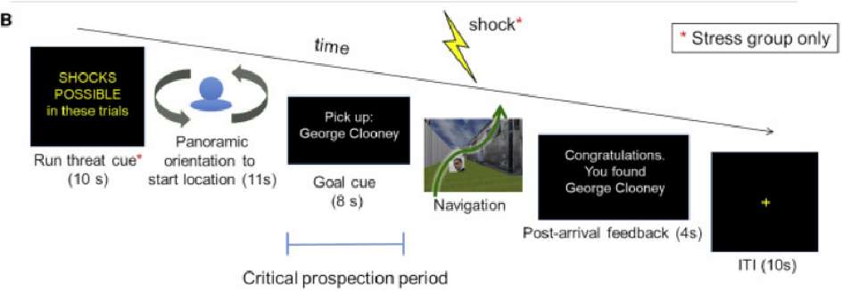
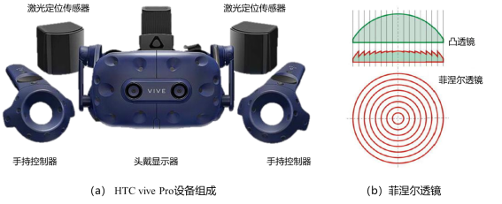
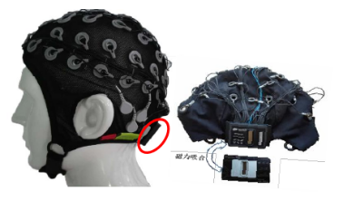
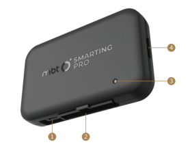

# VR_Navigation

Spatial navigation and social exploration in people with high and low social anxiety

## Introduction

In conjunction with EEG analysis, we explored the underlying neuropsychological mechanisms of spatial navigation and social exploration in people with high and low social anxiety, focusing on the relationship between individuals' spatial memory abilities and preferences and the rewards or punishments received by them, as well as when they receive positive or negative feedback from others in the process of social navigation in a population with varying levels of anxiety, ranging from normal people to patients with clinical anxiety disorders in hospitals. We investigated the relationship between individuals' spatial memory abilities and preferences and the rewards or punishments they receive, as well as the extent to which positive or negative feedback from others during social navigation affects the spatial navigation abilities and curiosity for spatial exploration of differently anxious people.

We designed a paradigm in which we searched for landmark objects in virtual reality and touched interacting boxes (positively: getting gold coins; negatively: bombs) or avatars (positively: greeting happily; negatively: sighing and spreading their hands with indifference) along the way, linking the positive or negative scenarios to the subjects' real rewards, and analyzed the positive or negative rewards in combination with questionnaires, EEG analyses, reacquaintance tests of spatial memory and preference questionnaires, as well as a scenario placement task. As well as the scene placement task, we analyzed the subjects' walking trajectories and explored the correlations between the questionnaire, the level of scene re-recognition, and the EEG signals of the labeled information during the experiment.

## Device

### VR Technique

#### Hardware: HTC Vive Pro

The VR device used in this experiment is the HTC vive Pro, which is one of the better performing VR experiences on the market today.
The VIVE provides the user with an immersive experience through three components: a head-mounted display, two single-handed controllers, and a positioning system that tracks both the display and the controllers in space. The head-mounted display utilizes a 4K screen, so users will not feel the screen door effect.
Fresnel lens is used in the display technology, as shown in the figure, which can keep the image brightness consistent, the imaging quality is uniform, avoiding the corners of the darkening, blurring and other problems. Even without glasses, myopia of about 400 degrees can see the details of the image.
Controller positioning system Lighthouse does not need to use the camera, but rely on laser and photosensitive sensors to determine the position of the head-mounted display and hand-held controller, allowing the user to walk around within a certain range.

#### Software: Unity 3D 2020.1.0f1c

HTC vive needs to be used together with a PC, which is responsible for the control and information processing functions. SteamVR platform is installed on the PC to drive and control the VIVE, and virtual engine tools such as Unity and UE4 are used to create the virtual scene content, and the video playback program and self-assessment scale in this study are created using the Unity engine.

### EEG Tools

#### Hardware

mbt SMARTING Streamer removable EEG device, including EEG amplifier and EEG cap

The EEG cap is shown in Figure above, combined with a noninvasive EEG electrode, an electrode wire, and a cap for immobilizing action. The electrode wire of the EEG cap is connected to the electrode at one end and to the wireless EEG amplifier at the other end.

The signal amplifier is shown in the figure, where the functions of the marked points are shown below:
①USB-TypeC
Charge the amplifier by plugging in the USB-TypeC cable to the computer port or cell phone charger (computer port charging is recommended)
② EEG Electrode Cap Connection Port
Connect the amplifier to the electrode cap via the connector on the back of the cap.
③Working status indicator
④SD card slot

## Pipeline
