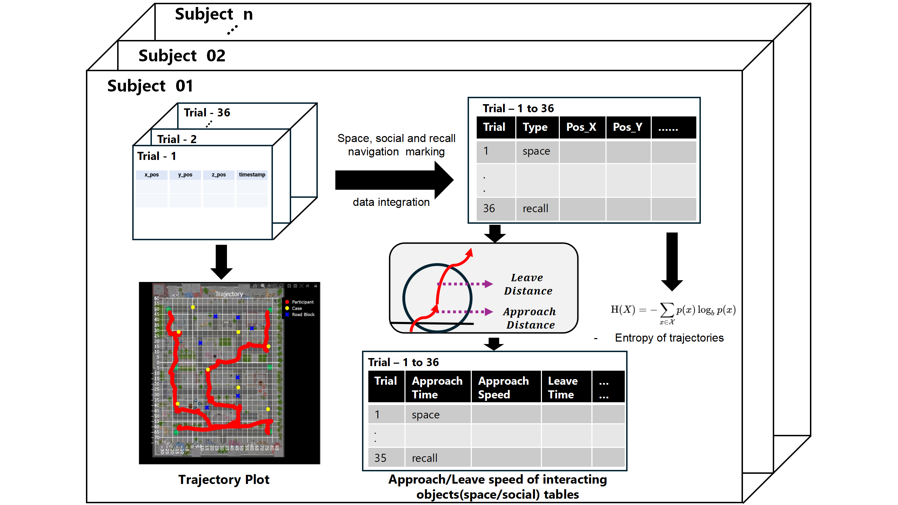

## Trajectory Data preprocessing code for *An EEG Dataset of Exploring Navigation in Virtual Reality* dataset

### Preprocessing Procedure

### Introduction

This is Preprocessing Trajectory code of *An EEG Dataset of Exploring Navigation in Virtual Reality DATASET*

**Anxiety_and_Rating.py**: processes and analyzes the participants' anxiety and willingness data and generates an Excel file called Anxiety_and_Willing_Rate.xlsx. In this file, the participants' anxiety and willingness ratings data from the experiment are stored. After filtering and merging, the final results are saved as Anxiety_and_Willing_Rate_Merged.xlsx and Anxiety_and_Willing_Rate_Grouped.xlsx files.

**Close_leave_entropy.py**: Generate and save multiple Excel and CSV files, mainly for analyzing participants' paths, interaction times and entropy values in the experiment. It will generate Nav_Entropy_Merged.xlsx file to record the path entropy data for each participant in different experimental conditions; Nav_Entropy_Grouped.xlsx file to calculate and group the average entropy value of each participant in spatial navigation, social navigation, and memorization tasks; and for each participant, Nav_Entropy_Grouped.xlsx file to generate the approach_interact_leave_time_[subject_id].csv file containing information on approach time, interaction time, leave time, approach speed, and leave speed. All these files provide detailed experimental data for further data analysis and visualization.

**Close_leave_entropy_2.py**: Analyze the participants' approach and departure speeds and distances during the spatial navigation and social navigation tasks and save the results as multiple Excel files, generate merged data containing each participant's approach speeds, departure speeds, approach distances, and departure distances for the different blocks of trials, respectively, and save them as Spatial_Approach_Leave_Distance_ Speed_Merged.xlsx and Social_Approach_Leave_Distance_Speed_Merged.xlsx files, the gen_space_close_leave_grouped and gen_social_close_leave_grouped functions group the data by trial block (e.g., blocks 1, 3, and 5 for spatial navigation and blocks 2, 4, and 6 for social navigation), respectively, and calculate the average approach and leave speeds and distances for each participant, which are generated and saved as Spatial_Approach_Leave_Distance_Speed_Grouped.xlsx and Social_ Approach_Leave_Distance_Speed_Grouped.xlsx files.

**Loss_trial_detection.py**: Used to automatically check the number of skipped trials out of 36 Navigation trials due to program bugs, which need to be manually checked again.
**map_standard_plot.py** Trajectories are plotted based on participants' experimental data, showing their positions in different experimental blocks, reward and punishment goals, and road obstacles. By reading the coordinates of each participant's position in different experimental blocks, the code uses the Plotly library to plot the participant's trajectory and label the reward goals (yellow), penalty goals (blue), and road obstacles. The charts also contain custom background images to provide interactive viewing, and ultimately the trajectory charts for each experimental block are saved as HTML files for easy viewing in a browser. The generated file name is plot_mul_block_II_<block_number>.html.

**NavTime_Speed_Pausing.py**: used to process and analyze data such as participants' navigation time, total distance, speed, and pause time in an experiment. It first calculates the navigation time and distance for each participant in different experiments and generates a merged file NavTotalTime_Distance_Merged.xlsx containing all the experimental data.Next, the code calculates the average of each metrics based on different experimental tasks (e.g., spatial navigation, social navigation, and memory tasks) and different experimental blocks to generate grouped statistics after grouping and saved as NavTotalTime_Distance_Grouped.xlsx file.

**reward.py**: To be used to process and analyze participants' reward score data from the experiment. It first extracts the reward data from each participant's CSV file and organizes it into a table that includes the score, trial type, and trial number for each trial. Next, the code calculates the average reward score and total score for each participant in the spatial navigation, social navigation, and memory tasks and saves the results as Reward_Merged.xlsx and Reward_Grouped.xlsx files. In addition, the code categorizes the participants' average reward scores into 10 levels and generates a CSV file whole_score2.csv containing the ratings.

**vrdataplot.py**: Used to extract and visualize experimental trajectory data of participants under different task conditions. It will categorize the data according to the type of experiment (e.g., spatial navigation, social navigation, memory task) and generate trajectory animations and still images for each participant. With multi-threaded processing, the data for each participant can be processed in parallel, increasing efficiency. The generated files include trajectory animation files in `.mp4` format and static trajectory images in `.png` format, which are categorized according to task type and memory status and saved in the corresponding folders for subsequent analysis and presentation.

**map_standard_plot.py**: Used to extract and visualize experimental trajectory data of participants under different task conditions. Same as script **vrdataplot.py**, but uses plotly module to realize interactive images. The generated files include trajector interactive files in `.html` format.

**Trajectory_Table_Gen.py**: generates an Excel file (in `.xlsx` format) for each participant named `sub_<subject_id>.xlsx`, where `<subject_id>` is the participant's ID. e.g., for a participant with a participant ID of 348, the generated file would be named `sub_348.xlsx`. These Excel files contain all the trajectory data of the participant during the experiment, specifically: the participant ID (`sub_ID`), the index number of the file (`index`), the number of the task block (`block`), the type of the task (`type`, which may be “Memory” or “Test”), the type of experiment (`stats`, which may be “Space” or ‘Social’), the directory where the file is located or the name of the experiment task (`listname`), the coordinates of the participants (`x_pos`, `y_pos`, `z_pos`), and the timestamp of the data record (`timestamp`). The generated files will be stored under the specified directory (`PosTable/`) for subsequent data analysis and visualization.
